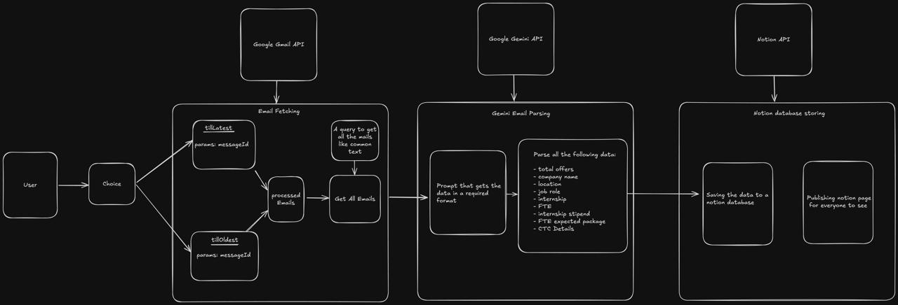

# PlacementDex

## Introduction 
**Overview
Purpose :**
 The script automates the process of fetching job offer emails, extracting key information from them, and storing this information in a Notion database for easy access and visibility.This script automates the tedious process of manually extracting and organizing job offer details from emails, leveraging powerful APIs to streamline the workflow and improve efficiency


## Motivation
This project stems from the frustration of manually managing job offer details scattered across emails. Inspired by Aryan Gupta's PlacementBuddy.pro, I collaborated with Harsh Sharma to develop a tool that automates the entire process, leveraging smart search, AI-powered extraction, and Notion integration for a streamlined workflow. This project aims to improve efficiency and provide valuable insights for students navigating the job search process.


## How to run this script

1. Git clone this repo 
   ```
   git clone <link>
   ```
2. Create .env file that contains :-  

     1. GEMINI_API_KEY = your_gemini_key
     2. NOTION_API_KEY = your_Notion_api_key
     3. NOTION_DATABASE_ID = your_NotionDatabase_ID
     4. TNP_EMAILS = example1@gmail.com,example2@gmail.com,example3@gmail.com(Put Emails of your TNP CELL from your college)

     5. NODE_ENV = development (Keep it same)

3. Create .gitignore file.It will contain these files :-
     1. credentials.json
     2. .env
     3. node_modules
     4. oauth-credentials.json
     5. oauth-token.json
     6. processed-emails.json
     7. failed-emails.json 
     
4. Run Your Application after filling the required data.

   ```
   npm start
   ```


## How to get these Keys 
1. GEMINI_API_KEY
2. NOTION_API_KEY
3. NOTION_DATABASE_ID 

<br>

- ### Gemini API

1. Search Gemini API keys on google and then open google ai for developer.
2. Click on Get a Gemini API key in Google AI Studio.
3. Create API key .

<br>

- ### Notion API keys

- (You can refer this https://developers.notion.com/docs/create-a-notion-integration)
1. Search Notion API Keys on google.Open the notion webpage.
2. Create your integration in Notion.(<https://www.notion.com/my-integrations>.)
3. Click + New integration.
4. Enter the integration name and select the associated workspace for the new integration.
5. API requests require an API secret to be successfully authenticated. Visit the Configuration tab to get your integration's API secret (or “Internal Integration Secret”).
6. Give your integration page permissions.
(Do the same as mentioned in the website)

<br>

- ### Notion Database ID keys
1. Login to your Notion Account .
2. Select the database .
3. Observe the link.The Database id is from www.notion.so/ to the question mark ?

    for Example : Here the database id is 162a51b137f480a7trtew92244 from the link given below. 

   ```
      https://www.notion.so/162a51b137f480a7trtew92244?v=162a51brte
   ```

---

<br>

## Create a table in notion with these attributes(columns)
- This is required because in the scrpit we have asked AI to fetch the following details into notion.
(You can change the prompt and then change the notion table's columns as per requirement of given prompt) 

1. Company_Name
2. Job_Role
3. Internship_Stipend
4. Internship_Duration
5. Job_Location
6. No_of_students_who_got_offers
7. CTC_Details
8. FTE_Expected_package
9. FTE_Package
10. Bond


<br> 


### How to get these Credentials 
1. Please read from - https://support.google.com/cloud/answer/6158849?hl=en
2. Go to your Project Section then go to Credentials .
3. Please Enable Gmail API . (You can find Gmail Service in Library section by searching 'Gmail' )
4. Select Create Credentials - OAuth Client ID - Select Application type as "Desktop APP".
5. Download JSON file . Name it as "oauth-credentials.json". Save it in your PlacementDex Folder.
6. Go to OAuth Consent screen -> Production -> Select Publish APP.
7. In the same page put "your_email_id" under "Test Users".


<br>


## How you can modify it ?
- Instead of using generic 'Training And Placement Cell (TNP)' emails, utilize your college's specific TNP cell email addresses. Identify a common keyword (in the subject or body) consistently used in their placement-related emails. Replace this keyword 'congratulations' within the prompt to extract the desired data into the Notion database.


### Work Flow of the Scrpit



1. **Finds and Reads:** It searches your Gmail for emails with "congratulations" in body or subject of emails (customizable : You can use any other common text ) and extracts the full content.

2. **Extracts Key Details:** A smart AI (Gemini) reads the emails and pulls out important information like company name, job title,salary,location etc.

3. **Organizes in Notion:**  The script saves all this extracted information in a neat and organized database within your Notion account for easy access and sharing.


